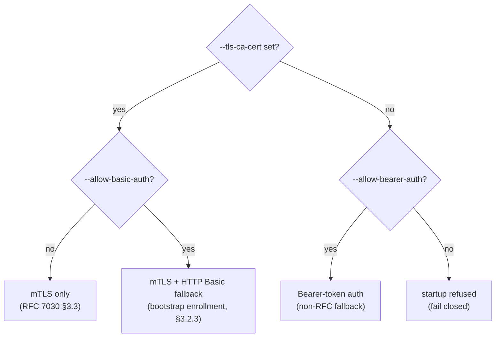

# EST Server — Administrator Guide

How to configure, secure, and operate the OstrichPKI EST enrollment server
(`ostrich-est-server`, RFC 7030).

- Design reference: [docs/architecture/EST_MODULE_DESIGN.md](../architecture/EST_MODULE_DESIGN.md)
- Security review: [docs/security/EST_SECURITY_REVIEW_2026-06-14.md](../security/EST_SECURITY_REVIEW_2026-06-14.md)

## 1. What it does

The EST server authenticates clients, validates their CSRs, authorizes the
requested certificate identity, and forwards issuance to the CA service over
gRPC. It holds no signing keys. Endpoints:

| Endpoint | Purpose | Auth |
|----------|---------|------|
| `GET /.well-known/est/cacerts` | CA certificate distribution (RFC 7030 §4.1) | public |
| `GET /.well-known/est/csrattrs` | CSR attributes (§4.5) | public |
| `POST /.well-known/est/simpleenroll` | Enroll (§4.2.1) | client |
| `POST /.well-known/est/simplereenroll` | Renew (§4.2.2) | client |
| `POST /.well-known/est/serverkeygen` | Server-side key generation (§4.4) | client |
| `GET /health`, `GET /ready` | Liveness / readiness | public |

## 2. Configuration

The server can be configured three ways, with this precedence (highest first):

1. **CLI flags** (e.g. `--bind-address`)
2. **Environment variables** (e.g. `EST_BIND_ADDRESS`)
3. **JSON config file** (`--config <path>` or `EST_CONFIG`)
4. built-in defaults

CLI/env always override the config file; the file overrides the defaults. So you
can keep a base config file under version control and override per-environment
secrets via env vars.

### Config file

Pass a JSON file with `--config /etc/ostrich/est-server.json`. It is validated
against [`config/schema/est-server.schema.json`](../../config/schema/est-server.schema.json)
at startup — an unknown key, wrong type, or invalid `enrollIdentityPolicy` value
fails fast with a clear error. A complete annotated sample is at
[`config/est_server.example.json`](../../config/est_server.example.json).

```jsonc
{
  "$schema": "./schema/est-server.schema.json",
  "bindAddress": "0.0.0.0:8443",
  "caGrpcUrl": "https://ostrich-ca:50051",
  "caGrpcClientCert": "/etc/ostrich/est/ca-client.crt",
  "caGrpcClientKey": "/etc/ostrich/est/ca-client.key",
  "caGrpcCaCert": "/etc/ostrich/est/ca-server-ca.crt",
  "enrollIdentityPolicy": "username",
  "tlsCert": "/etc/ostrich/est/server.crt",
  "tlsKey": "/etc/ostrich/est/server.key",
  "tlsCaCert": "/etc/ostrich/est/client-ca.crt",
  "logJson": true
}
```

> Keep secrets (like `databaseUrl` with an embedded password) out of the file —
> supply them via `DATABASE_URL` instead. Config keys are camelCase; the
> equivalent CLI flags are kebab-case and env vars are upper snake-case.

### Reference

Every setting can be given as a config-file key, a CLI flag, or an env var.

| Config key | Flag | Env | Default | Description |
|------------|------|-----|---------|-------------|
| — | `--config` | `EST_CONFIG` | — | Path to a JSON config file (schema-validated) |
| `bindAddress` | `--bind-address` | `EST_BIND_ADDRESS` | `0.0.0.0:8443` | HTTPS listen address |
| `databaseUrl` | `--database-url` | `DATABASE_URL` | — (required) | PostgreSQL connection |
| `caGrpcUrl` | `--ca-grpc-url` | `CA_GRPC_URL` | — | CA gRPC endpoint for issuance |
| `enrollProfile` | `--enroll-profile` | `EST_ENROLL_PROFILE` | `tls_client` | Certificate profile used for issuance |
| `tlsCert` | `--tls-cert` | `TLS_CERT_FILE` | — | Server TLS certificate (PEM) |
| `tlsKey` | `--tls-key` | `TLS_KEY_FILE` | — | Server TLS private key (PEM) |
| `tlsCaCert` | `--tls-ca-cert` | `TLS_CA_CERT_FILE` | — | Trust anchor for **mTLS client auth**; presence enables mTLS |
| `enrollIdentityPolicy` | `--enroll-identity-policy` | `EST_IDENTITY_POLICY` | `username` | Identity authorization policy: `username` or `allowlist` (see §5) |
| `allowBasicAuth` | `--allow-basic-auth` | `EST_ALLOW_BASIC_AUTH` | `false` | Accept HTTP Basic as a fallback (requires `tlsCaCert`) |
| `allowBearerAuth` | `--allow-bearer-auth` | `EST_ALLOW_BEARER_AUTH` | `false` | Permit bearer-token auth when no mTLS CA configured |
| `caGrpcClientCert` | `--ca-grpc-client-cert` | `CA_GRPC_CLIENT_CERT_FILE` | — | Client cert (PEM) for mTLS to the CA |
| `caGrpcClientKey` | `--ca-grpc-client-key` | `CA_GRPC_CLIENT_KEY_FILE` | — | Client key (PEM) for mTLS to the CA |
| `caGrpcCaCert` | `--ca-grpc-ca-cert` | `CA_GRPC_CA_CERT_FILE` | — | CA cert (PEM) verifying the CA gRPC server |
| `caInsecure` | `--ca-insecure` | `CA_GRPC_INSECURE` | `false` | **Dev only** — allow plaintext gRPC to a non-loopback CA |
| `logLevel` | `--log-level` | `RUST_LOG` | `info` | Log level |
| `logJson` | `--log-json` | `LOG_JSON` | `false` | JSON structured logs |

## 3. Authentication modes

The mode for the enrollment endpoints is determined by your flags:



- **Production (recommended): mTLS.** Provide `--tls-ca-cert` (plus the server
  `--tls-cert`/`--tls-key`). Clients are mapped to accounts by their certificate
  subject. Client accounts/cert mappings are provisioned in the database.
- **Bootstrap enrollment**: add `--allow-basic-auth` so a client without a
  certificate can authenticate its first enrollment with a username/password,
  then switch to mTLS. Basic is rejected unless `--tls-ca-cert` is also set.
- **Bearer fallback**: with no `--tls-ca-cert`, the server refuses to start
  unless you pass `--allow-bearer-auth` (an explicit acknowledgement of the
  weaker, non-RFC posture — not for production).

## 4. Securing the EST → CA channel

The gRPC channel to the CA carries issuance requests and **must be mutually
authenticated in production**. The server fails closed: it refuses to open a
plaintext channel to a non-loopback CA endpoint.

- Production: set all three — `--ca-grpc-client-cert`, `--ca-grpc-client-key`,
  `--ca-grpc-ca-cert`. (Partial configuration is rejected at startup.)
- Local development with a loopback CA (`localhost`/`127.0.0.1`/`::1`): plaintext
  is permitted automatically.
- Non-loopback without mTLS: blocked unless you set `--ca-insecure` (dev only —
  never in production).

## 5. Certificate identity policy (`--enroll-identity-policy`)

Controls which identity a caller may request in a certificate.

### `username` (default)
The CSR must name the authenticated account in its CommonName **or** a SAN.
Best when each account corresponds to one device/identity.

### `allowlist`
Every identity the CSR asserts (CN + each SAN value) must be present in that
account's allow-list. Use this for **delegated enrollment** — e.g. one
Registration Authority account permitted to request several device names.

> ⚠️ In `allowlist` mode an account with **no** allow-list entries is denied all
> enrollments until provisioned. Populate the allow-list before switching a fleet
> to this mode.

#### Managing the allow-list (admin API)

The allow-list is managed over an admin API that uses the **same authentication
scheme as enrollment** (per `--enroll-identity-policy`/`auth_mode`): a bearer
session token in bearer/Basic deployments, or a client certificate in mTLS
deployments (mapped to an account that holds the management role). Authorization
requires the permissions below; denied and failed attempts are audited.

| Method & path | Permission | Purpose |
|---------------|-----------|---------|
| `GET /api/v1/est/accounts/{account}/identities` | `ViewConfig` | List an account's allowed identities |
| `POST /api/v1/est/accounts/{account}/identities` | `ModifyConfig` | Add an identity (body `{ "identity": "..." }`) |
| `DELETE /api/v1/est/accounts/{account}/identities/{identity}` | `ModifyConfig` | Remove an identity (404 if not present) |

Identities are **bare values** (no `DNS:`/`email:` prefix), e.g. `device-42.example.com`,
and are **canonicalized to lowercase** (trimmed, ≤255 chars, no control characters)
on both storage and the enrollment-time check — so add `device-42.example.com`, not
`Device-42.Example.com`. Every successful or failed add/remove is recorded as a
`ConfigurationChange` audit event (CM-3); the DELETE path is a catch-all segment,
so identities containing `/` (e.g. URI SANs) can still be revoked.

```bash
# Grant the RA account 'ra-fleet-1' two device identities:
curl -sS -X POST https://est.example.com/api/v1/est/accounts/ra-fleet-1/identities \
  -H "Authorization: Bearer $TOKEN" -H "Content-Type: application/json" \
  -d '{"identity":"device-42.example.com"}'

curl -sS https://est.example.com/api/v1/est/accounts/ra-fleet-1/identities \
  -H "Authorization: Bearer $TOKEN"
# -> {"account":"ra-fleet-1","identities":["device-42.example.com"]}

# Revoke one (URL-encode identities containing reserved characters):
curl -sS -X DELETE \
  https://est.example.com/api/v1/est/accounts/ra-fleet-1/identities/device-42.example.com \
  -H "Authorization: Bearer $TOKEN"
```

> Direct SQL against `est_account_identities` also works for bulk seeding, but the
> API is preferred because it enforces RBAC and writes an audit trail.

## 6. Deployment example (production, mTLS both sides)

```bash
ostrich-est-server \
  --bind-address 0.0.0.0:8443 \
  --database-url "$DATABASE_URL" \
  --tls-cert /etc/ostrich/est/server.crt \
  --tls-key  /etc/ostrich/est/server.key \
  --tls-ca-cert /etc/ostrich/est/client-ca.crt \
  --enroll-identity-policy username \
  --ca-grpc-url https://ostrich-ca:50051 \
  --ca-grpc-client-cert /etc/ostrich/est/ca-client.crt \
  --ca-grpc-client-key  /etc/ostrich/est/ca-client.key \
  --ca-grpc-ca-cert     /etc/ostrich/est/ca-server-ca.crt \
  --log-json true
```

Equivalent using a config file (with the database URL still supplied via env so
the secret stays out of the file):

```bash
DATABASE_URL="postgresql://…" \
ostrich-est-server --config /etc/ostrich/est-server.json
```

Run database migrations (including `00010_est_account_identities.sql`) before
first start; the server applies migrations on startup.

## 7. Operations

- **Health checks**: `GET /health` (liveness), `GET /ready` (readiness; checks DB
  connectivity). See [HEALTH_CHECKS.md](../HEALTH_CHECKS.md).
- **Sessions** are in-memory (bearer/Basic modes): they do not survive a restart
  and do not replicate across instances.
- **Auditing**: every enrollment outcome and security-relevant failure (failed
  PoP, identity-binding denial, CA issuance failure) is written to the audit log.

## 8. Troubleshooting

| Symptom | Likely cause | Action |
|---------|--------------|--------|
| Startup error: "config failed schema validation" | Unknown key, wrong type, or invalid `enrollIdentityPolicy` in the config file | Fix the offending key (see the error's JSON path) against `config/schema/est-server.schema.json` |
| Startup error: "database URL is required" | No `databaseUrl`/`--database-url`/`DATABASE_URL` anywhere | Supply it via env (preferred) or the config file |
| Startup error: "no TLS client CA configured … pass --allow-bearer-auth" | No `--tls-ca-cert` and bearer not opted in | Configure mTLS (preferred) or add `--allow-bearer-auth` for non-prod |
| Startup error: "refusing … plaintext gRPC channel to non-loopback CA" | Missing CA mTLS material | Set `--ca-grpc-client-cert/-key/-ca-cert`, or `--ca-insecure` for dev |
| Startup error: "CA gRPC mTLS requires all of …" | Only some CA mTLS files provided | Provide all three PEMs |
| Startup error: "--allow-basic-auth requires --tls-ca-cert" | Basic without mTLS | Add `--tls-ca-cert`, or drop `--allow-basic-auth` |
| Client gets `403`, body "CSR subject CN or a SAN must match…" | Identity policy denial (H1) | Align the CSR identity with the account, or use/provision `allowlist` |
| Client gets `403` on `simplereenroll` | New CSR subject/SAN ≠ prior certificate | Re-enroll must keep the same identity; use `simpleenroll` for a new one |
| Client gets `401` + `WWW-Authenticate: Basic` | Missing/invalid Basic credentials | Provide valid credentials; check account lockout |
| Enrollment returns `500` "internal error" | Detail intentionally withheld from client | Check server logs (full error is logged with the request) |
| `415`/empty `/cacerts` | No default CA certificate registered | Register the CA certificate so `/cacerts` can serve it |
