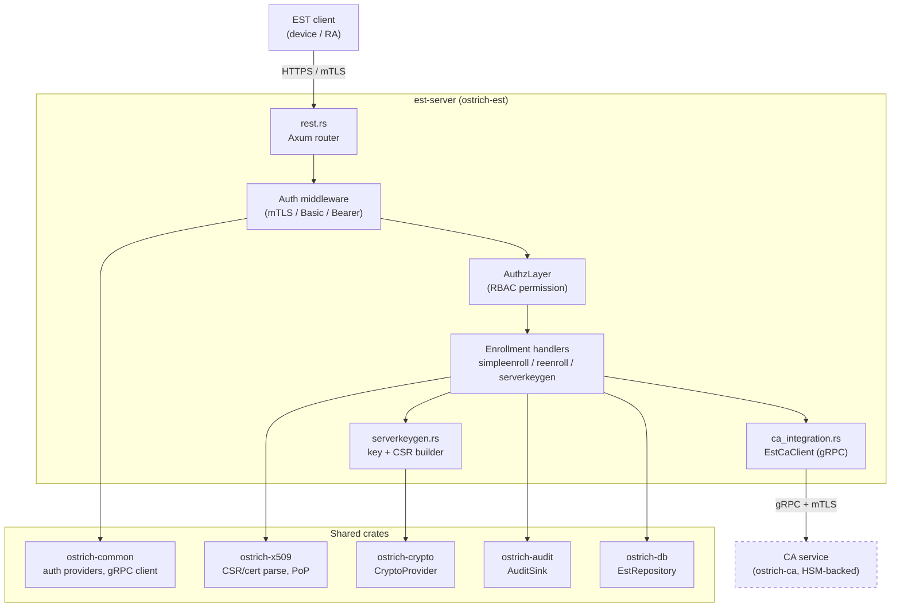
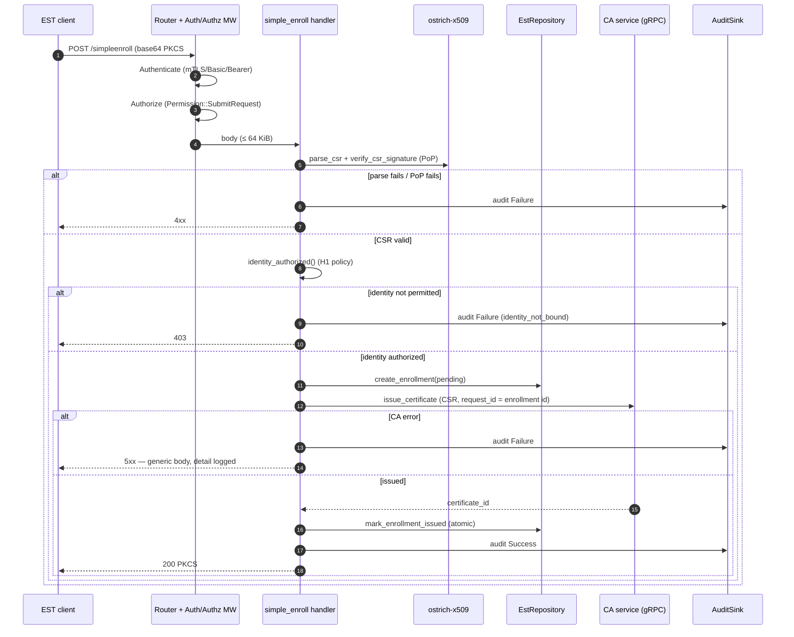
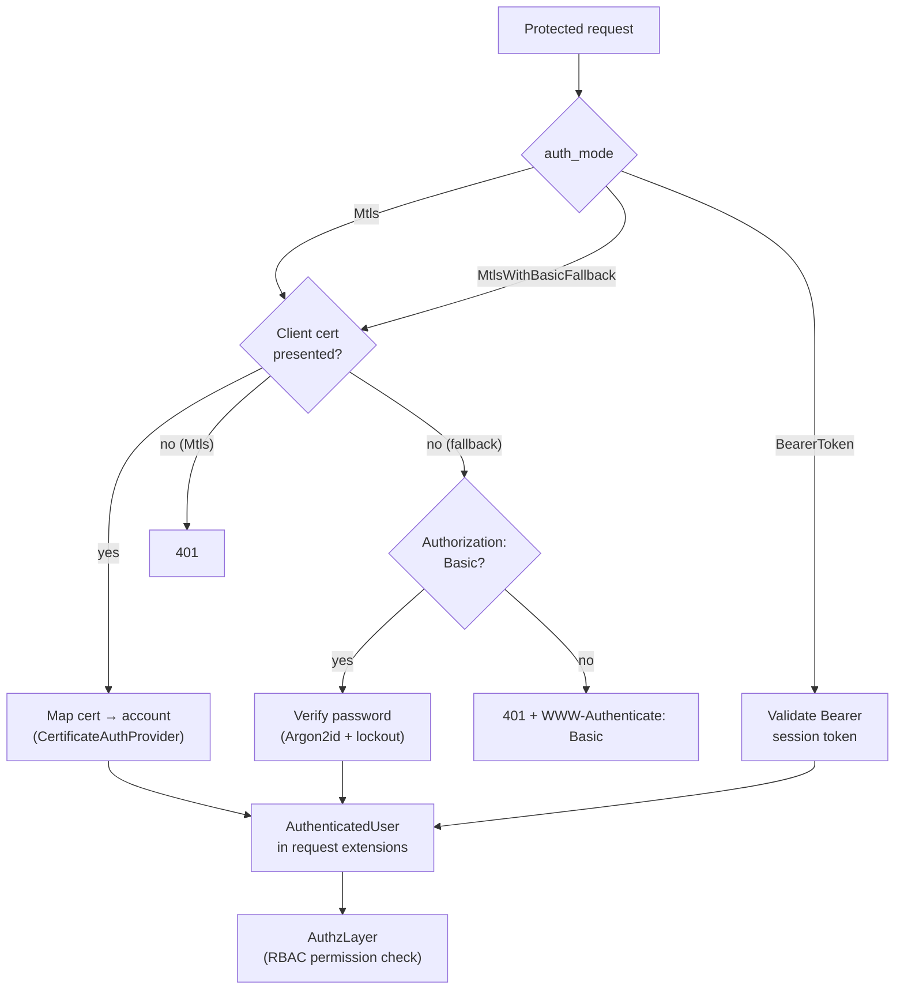
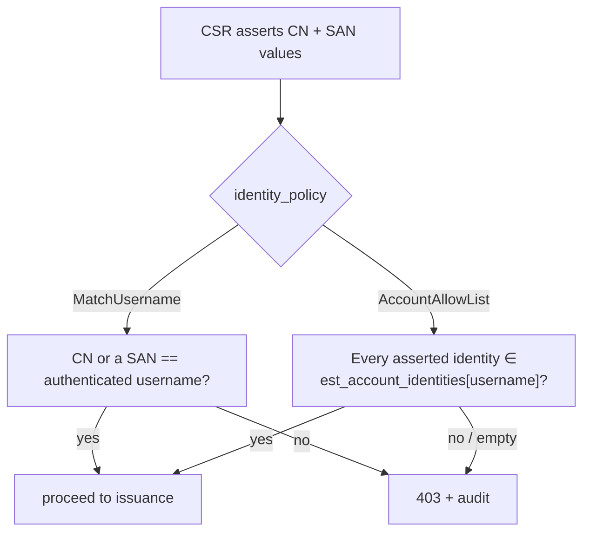

# EST Module Design

This document describes the design of the OstrichPKI EST (Enrollment over Secure
Transport, **RFC 7030**) subsystem: its components, request flows, authentication
and authorization model, and the trust boundaries that make it ATO-relevant.

- Crate: [`crates/ostrich-est`](../../crates/ostrich-est)
- Binary: [`services/est-server`](../../services/est-server)
- Operator guide: [docs/admin/EST_SERVER.md](../admin/EST_SERVER.md)
- Security review: [docs/security/EST_SECURITY_REVIEW_2026-06-14.md](../security/EST_SECURITY_REVIEW_2026-06-14.md)

## 1. Purpose & scope

EST is an enrollment front end. It does **not** hold CA private keys or sign
certificates itself — it authenticates clients, validates their CSRs, authorizes
the requested identity, and forwards issuance to the CA service over gRPC. This
separation keeps signing keys behind the CA/HSM trust boundary.

Implemented RFC 7030 functions:

| Endpoint | RFC 7030 | Auth | Permission |
|----------|----------|------|------------|
| `GET /.well-known/est/cacerts` | §4.1 | none (public) | — |
| `GET /.well-known/est/csrattrs` | §4.5 | none (public) | — |
| `POST /.well-known/est/simpleenroll` | §4.2.1 | client | `SubmitRequest` |
| `POST /.well-known/est/simplereenroll` | §4.2.2 | client | `RenewCertificate` |
| `POST /.well-known/est/serverkeygen` | §4.4 | client | `SubmitRequest` |
| `GET /health`, `GET /ready` | — | none | — |

Admin/management API (not part of RFC 7030). Authenticated with the same scheme
as enrollment (`auth_mode`): bearer session token, or mTLS client certificate in
mTLS deployments. Authorization is enforced in-handler (so denials are audited):

| Endpoint | Permission | Purpose |
|----------|------------|---------|
| `GET /api/v1/est/accounts/{account}/identities` | `ViewConfig` | List an account's allow-list |
| `POST /api/v1/est/accounts/{account}/identities` | `ModifyConfig` | Add an allowed identity |
| `DELETE /api/v1/est/accounts/{account}/identities/{*identity}` | `ModifyConfig` | Remove an allowed identity |

## 2. Component overview



Trust boundaries (dashed = crosses a network and must be mutually authenticated):

- **Client → EST**: TLS 1.3; client authenticated by mTLS certificate and/or
  HTTP Basic (see §4).
- **EST → CA**: gRPC, **mTLS required in production**. This channel carries
  issuance requests; if unauthenticated, an attacker on the path could forge
  issuance. The client fails closed for non-loopback endpoints without TLS
  material (see [admin guide](../admin/EST_SERVER.md) `--ca-grpc-*`).

## 3. Enrollment request flow (`simpleenroll`)



`simplereenroll` adds an identity-binding step against the client's prior
certificate (see §5). `serverkeygen` generates the key pair server-side, builds a
CSR signed by it for proof-of-possession, returns a `multipart/mixed` of the
PKCS#8 private key + the certificate, and destroys/zeroizes the key material.

## 4. Authentication model

The client-authentication mode for the protected endpoints is selected at
startup (`EstAuthMode`). The Basic path exists for **bootstrap enrollment** — a
client that has no certificate yet (RFC 7030 §3.2.3).



- mTLS / Basic / Bearer all converge on an `AuthenticatedUser` injected into the
  request, so the downstream RBAC check is identical regardless of method.
- Basic auth is only offered alongside mTLS on a TLS listener (it transmits a
  reusable password); the server refuses to enable it otherwise.
- Bearer-token mode is a non-RFC fallback and must be explicitly opted into when
  no TLS client CA is configured.

Relevant code: [`auth/middleware.rs`](../../crates/ostrich-common/src/auth/middleware.rs),
[`auth/basic.rs`](../../crates/ostrich-common/src/auth/basic.rs).

## 5. Authorization: identity binding (H1)

Authentication establishes *who* the caller is; identity binding enforces *what
identity they may request in a certificate*. Without it, any caller with
`SubmitRequest` could obtain a certificate for an arbitrary subject/SAN.

Two policies, selected by `EstIdentityPolicy` (`--enroll-identity-policy`):



- **MatchUsername** (default): suits one-account-per-identity deployments.
- **AccountAllowList**: supports delegated enrollment (one RA account provisioned
  for several device identities). Backed by `est_account_identities`
  (migration `00010`). Lookup failures fail closed.

Re-enrollment (`simplereenroll`) additionally binds to the client's **prior
certificate**: the new CSR's full subject DN *and* its complete SAN set must
match a certificate previously issued to the same account — preventing a client
from keeping its subject while adding new SAN identities.

## 6. Data model

- `est_enrollments` — one row per enrollment attempt (client id, CSR, status,
  issued `certificate_id`). `mark_enrollment_issued` records the certificate id
  and `issued` status in a single atomic UPDATE.
- `est_clients` — mTLS-authorized clients (cert hash → authorized profiles).
- `est_account_identities` — per-account allow-list for the `AccountAllowList`
  policy (`account_username` → `allowed_identity`).

## 7. Security & compliance properties

- **Fail secure**: missing CA integration, CA errors, lookup errors, and
  unconfigured TLS all deny — no certificate is ever fabricated.
- **Audit (AU-2/AU-12)**: every enrollment outcome and every security-relevant
  failure (PoP, parse, identity binding, issuance) emits an audit event.
- **PoP (FCS_COP.1)**: CSR signatures are verified before issuance; for
  `serverkeygen` the server signs the CSR with the generated key.
- **Key hygiene (SC-12/FCS_CKM.4)**: server-generated keys are zeroized and the
  key handle destroyed after the response is built.
- **No detail leakage (SI-11)**: 5xx responses return a generic body; full
  detail is logged server-side.

See the [compliance docs](../compliance) for the control-by-control mapping.
```
