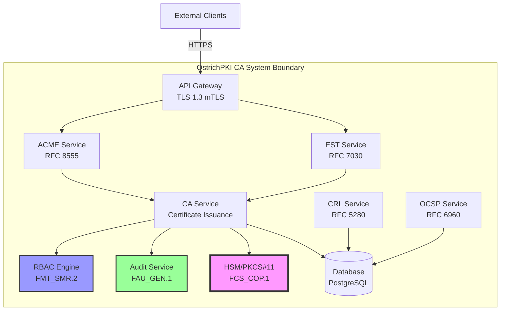

# Authority to Operate (ATO) Evidence Collection Guide

**Document Version:** 1.0
**Generated:** 2026-01-03
**Framework:** NIST Risk Management Framework (RMF)
**Compliance Standards:** NIST 800-53 Rev 5, NIAP PP-CA v2.1, FIPS 140-2/140-3

---

## Executive Summary

This guide provides procedures for collecting, organizing, and maintaining evidence required for OstrichPKI's Authority to Operate (ATO) certification under the NIST Risk Management Framework (RMF). The evidence collected supports the System Security Plan (SSP), Security Assessment Report (SAR), and Plan of Action & Milestones (POA&M).

### ATO Documentation Requirements

| Document | Purpose | Evidence Sources |
|----------|---------|------------------|
| **System Security Plan (SSP)** | Describes security controls and implementation | Code annotations, configuration, architecture diagrams |
| **Security Assessment Report (SAR)** | Documents security control testing results | Test reports, audit logs, vulnerability scans |
| **Plan of Action & Milestones (POA&M)** | Tracks remediation of control weaknesses | Gap analysis, issue tracker, remediation plans |
| **Continuous Monitoring Plan** | Ongoing security assessment strategy | Audit logs, metrics, alerts, SIEM integration |

### Evidence Collection Maturity

| Phase | SSP Evidence | SAR Evidence | POA&M Evidence | Status |
|-------|--------------|--------------|----------------|--------|
| **Current (Phase 14)** | 40% | 30% | 80% | 🟡 Partial |
| **Phase 15 Complete** | 65% | 55% | 90% | 🟡 Partial |
| **Phase 16 Complete** | 80% | 70% | 95% | 🟡 Partial |
| **Phase 17 Complete** | 95% | 90% | 100% | 🟢 Ready for ATO |

---

## 1. System Security Plan (SSP) Evidence

The SSP describes how OstrichPKI implements each security control. Evidence includes code references, configuration files, and architectural documentation.

### 1.1 Automated Code Annotation Extraction

**Purpose:** Extract NIAP compliance annotations from codebase to demonstrate control implementation.

**Annotation Format:**

```rust
// NIAP PP-CA: <SFR_ID> - <description>
// NIST 800-53: <CONTROL_ID> - <description>
// RFC <NUMBER> §<SECTION> - <requirement>
// FIPS <NUMBER> - <requirement>
```

**Extraction Script:**

```bash
#!/bin/bash
# scripts/extract_compliance_annotations.sh

OUTPUT_DIR="evidence/ssp"
mkdir -p "$OUTPUT_DIR"

echo "Extracting compliance annotations from codebase..."

# Extract NIAP annotations
echo "## NIAP Protection Profile Annotations" > "$OUTPUT_DIR/niap_annotations.md"
grep -r "// NIAP PP-CA:" crates/ --include="*.rs" | \
  sed 's|crates/\([^:]*\):\([0-9]*\):.*// NIAP PP-CA: \(.*\)|\3 - [\1:\2](../crates/\1#L\2)|' | \
  sort | uniq >> "$OUTPUT_DIR/niap_annotations.md"

# Extract NIST 800-53 annotations
echo "## NIST 800-53 Control Annotations" > "$OUTPUT_DIR/nist_annotations.md"
grep -r "// NIST 800-53:" crates/ --include="*.rs" | \
  sed 's|crates/\([^:]*\):\([0-9]*\):.*// NIST 800-53: \(.*\)|\3 - [\1:\2](../crates/\1#L\2)|' | \
  sort | uniq >> "$OUTPUT_DIR/nist_annotations.md"

# Extract RFC annotations
echo "## RFC Compliance Annotations" > "$OUTPUT_DIR/rfc_annotations.md"
grep -r "// RFC" crates/ --include="*.rs" | \
  sed 's|crates/\([^:]*\):\([0-9]*\):.*// RFC \(.*\)|\3 - [\1:\2](../crates/\1#L\2)|' | \
  sort | uniq >> "$OUTPUT_DIR/rfc_annotations.md"

# Extract FIPS annotations
echo "## FIPS Compliance Annotations" > "$OUTPUT_DIR/fips_annotations.md"
grep -r "// FIPS" crates/ --include="*.rs" | \
  sed 's|crates/\([^:]*\):\([0-9]*\):.*// FIPS \(.*\)|\3 - [\1:\2](../crates/\1#L\2)|' | \
  sort | uniq >> "$OUTPUT_DIR/fips_annotations.md"

echo "Compliance annotations extracted to $OUTPUT_DIR"
```

**Usage:**

```bash
chmod +x scripts/extract_compliance_annotations.sh
./scripts/extract_compliance_annotations.sh
```

**Output Example:**

```markdown
## NIAP Protection Profile Annotations

FAU_GEN.1 - Audit data generation - [ostrich-audit/src/event.rs:47](../crates/ostrich-audit/src/event.rs#L47)
FAU_GEN.2 - User identity association - [ostrich-audit/src/event.rs:52](../crates/ostrich-audit/src/event.rs#L52)
FCS_RBG_EXT.1 - Random bit generation - [ostrich-crypto/src/drbg.rs:23](../crates/ostrich-crypto/src/drbg.rs#L23)
```

---

### 1.2 Configuration Evidence Collection

**Purpose:** Document secure configuration settings for SSP.

**Configuration Files to Collect:**

1. **Cryptographic Configuration** - `config/crypto.toml`

   ```toml
   # NIST 800-53: SC-13 - Cryptographic protection
   # FIPS 186-5: Digital Signature Standard

   [signature_algorithms]
   allowed = ["ECDSA-P256-SHA256", "ECDSA-P384-SHA384", "RSA-PSS-2048-SHA256", "Ed25519"]
   default = "ECDSA-P256-SHA256"

   [key_sizes]
   rsa_min = 2048        # NIST minimum
   ecdsa_min = 256       # P-256 curve

   [drbg]
   algorithm = "CTR_DRBG_AES256"  # NIST SP 800-90A
   reseed_interval = 1000000      # Reseed before 2^48 requests
   ```

2. **Audit Configuration** - `config/audit.toml`

   ```toml
   # NIST 800-53: AU-2, AU-3, AU-4, AU-5
   # NIAP PP-CA: FAU_GEN.1, FAU_STG.1

   [audit]
   storage_path = "/var/log/ostrich-audit"
   max_size_mb = 10240              # 10 GB
   retention_days = 365             # 1 year minimum
   overflow_action = "halt"         # Stop CA operations if audit full

   [events]
   enabled = "all"                  # Audit all security-relevant events
   include_actor = true             # AU-3: Identity in audit records
   include_timestamp = true         # AU-3: Timestamp in audit records
   include_outcome = true           # AU-3: Success/failure in audit records
   ```

3. **Access Control Configuration** - `config/rbac.toml`

   ```toml
   # NIST 800-53: AC-2, AC-3, AC-6
   # NIAP PP-CA: FMT_SMR.2

   [roles]
   administrator = ["manage_config", "manage_users", "backup_keys", "view_audit"]
   operations_staff = ["issue_certificate", "revoke_certificate", "generate_crl"]
   auditor = ["view_audit", "export_audit"]
   ra_staff = ["approve_request"]
   aor = ["manage_policy", "view_audit"]

   [least_privilege]
   enforce = true                   # AC-6: Least privilege
   default_role = "none"            # No default permissions
   ```

**Collection Script:**

```bash
#!/bin/bash
# scripts/collect_configuration_evidence.sh

OUTPUT_DIR="evidence/ssp/configuration"
mkdir -p "$OUTPUT_DIR"

# Copy all configuration files with annotations
for config in config/*.toml; do
  cp "$config" "$OUTPUT_DIR/"
done

# Generate configuration summary
cat > "$OUTPUT_DIR/README.md" << 'EOF'
# Configuration Evidence

This directory contains configuration files demonstrating implementation of security controls.

## Files

- `crypto.toml` - Cryptographic algorithm configuration (SC-13, FIPS 186-5)
- `audit.toml` - Audit system configuration (AU-2, AU-3, AU-4, AU-5)
- `rbac.toml` - Role-based access control (AC-2, AC-3, AC-6)
- `tls.toml` - TLS configuration (SC-8, SC-23)

## Control Mapping

| Control | Configuration File | Settings |
|---------|-------------------|----------|
| SC-13 | crypto.toml | Approved cryptographic algorithms |
| AU-2 | audit.toml | Auditable events enabled |
| AC-3 | rbac.toml | Role-permission matrix |
EOF

echo "Configuration evidence collected to $OUTPUT_DIR"
```

---

### 1.3 Architecture Diagrams

**Purpose:** Visual representation of system architecture for SSP.

**Required Diagrams:**

1. **System Context Diagram** - High-level system boundaries
2. **Component Diagram** - Internal service architecture
3. **Data Flow Diagram** - Certificate issuance workflow
4. **Network Diagram** - Deployment topology
5. **Trust Model Diagram** - PKI hierarchy

**Generation Tools:**

- Use `mermaid` for code-based diagrams (version controlled)
- Export to PNG/SVG for SSP inclusion

**Example - Component Diagram:**



**Storage Location:** `docs/architecture/diagrams/`

---

### 1.4 Control Implementation Statements

**Purpose:** Narrative description of how each control is implemented.

**Template:**

```markdown
## AC-2: Account Management

**Control Description:** The organization manages information system accounts including creation, modification, disablement, and removal.

**Implementation:**

OstrichPKI implements account management through the RBAC module ([crates/ostrich-rbac/src/lib.rs:45-120](crates/ostrich-rbac/src/lib.rs#L45-L120)). The system defines five distinct roles:

1. **Administrator** - System configuration and user management
2. **Operations Staff** - Certificate lifecycle operations
3. **Auditor** - Read-only audit log access
4. **RA Staff** - Certificate request approval
5. **AOR** - Policy management

**Account Lifecycle:**

- **Creation:** Administrators create user accounts via the `/api/users` endpoint, which requires administrator role authentication (AC-3).
- **Modification:** User role assignments are modified through the same API, with all changes audited (AU-2).
- **Disablement:** Accounts are disabled (not deleted) to preserve audit trail integrity.
- **Removal:** Account removal requires AOR approval and is only permitted after audit retention period.

**Evidence:**

- Code: [crates/ostrich-rbac/src/account.rs:23-89](crates/ostrich-rbac/src/account.rs#L23-L89)
- Configuration: [config/rbac.toml](config/rbac.toml)
- Database Schema: [migrations/002_create_users.sql](migrations/002_create_users.sql)
- Test Results: [tests/rbac/test_account_lifecycle.rs](tests/rbac/test_account_lifecycle.rs)
- Audit Events: `UserCreated`, `UserModified`, `UserDisabled`, `UserDeleted`

**Responsible Role:** Administrator

**Continuous Monitoring:** User account changes are logged to audit system and monitored via SIEM alerts for anomalous account creation/modification patterns.
```

**Generation Script:**

```bash
#!/bin/bash
# scripts/generate_control_statements.sh

OUTPUT_DIR="evidence/ssp/control_statements"
mkdir -p "$OUTPUT_DIR"

# Read control mappings from NIST_800-53_MAPPING.md and generate implementation statements
# This is a placeholder - actual implementation would parse the markdown and generate
# individual control implementation statements

echo "Generating control implementation statements..."

# Example: Generate AC family statements
cat > "$OUTPUT_DIR/AC_family.md" << 'EOF'
# Access Control (AC) Family Implementation Statements

## AC-2: Account Management
[Implementation statement as shown above]

## AC-3: Access Enforcement
[Implementation statement for RBAC authorization]

## AC-6: Least Privilege
[Implementation statement for role separation]
EOF

echo "Control statements generated in $OUTPUT_DIR"
```

---

## 2. Security Assessment Report (SAR) Evidence

The SAR documents the results of security control testing. Evidence includes test execution logs, vulnerability scan results, and penetration testing reports.

### 2.1 Unit Test Results Collection

**Purpose:** Demonstrate that security functions work as designed.

**Test Execution:**

```bash
#!/bin/bash
# scripts/collect_test_results.sh

OUTPUT_DIR="evidence/sar/test_results"
mkdir -p "$OUTPUT_DIR"

echo "Running comprehensive test suite..."

# Run all tests with verbose output
cargo test --all --no-fail-fast -- --nocapture 2>&1 | tee "$OUTPUT_DIR/all_tests.log"

# Run security-specific tests
cargo test --all security -- --nocapture 2>&1 | tee "$OUTPUT_DIR/security_tests.log"

# Run cryptographic tests with NIST vectors
cargo test --all crypto::tests::nist_vectors -- --nocapture 2>&1 | tee "$OUTPUT_DIR/crypto_nist_tests.log"

# Run RBAC authorization tests
cargo test --all rbac::tests::authorization -- --nocapture 2>&1 | tee "$OUTPUT_DIR/rbac_tests.log"

# Run audit system tests
cargo test --all audit::tests -- --nocapture 2>&1 | tee "$OUTPUT_DIR/audit_tests.log"

# Generate test coverage report
cargo tarpaulin --all --out Html --output-dir "$OUTPUT_DIR/coverage"

# Generate JUnit XML for CI/CD integration
cargo test --all -- -Z unstable-options --format junit > "$OUTPUT_DIR/junit.xml"

echo "Test results collected to $OUTPUT_DIR"
```

**Test Categories for SAR:**

| Category | Purpose | Example Tests | Control Mapping |
|----------|---------|---------------|-----------------|
| **Cryptographic** | Validate crypto algorithms | NIST CAVP test vectors, signature verification | SC-13, FCS_COP.1 |
| **Authentication** | Validate mTLS and auth | Certificate validation, invalid cert rejection | IA-2, FIA_X509_EXT.1 |
| **Authorization** | Validate RBAC enforcement | Role permission checks, unauthorized action denial | AC-3, FMT_SMR.2 |
| **Audit** | Validate audit logging | Event capture, integrity verification | AU-2, AU-3, FAU_GEN.1 |
| **Input Validation** | Validate CSR/cert validation | Malformed CSR rejection, field validation | SI-10 |
| **Self-Test** | Validate integrity checks | Startup tests, KAT execution | FPT_TST_EXT.1 |

**Expected Test Results:**

- **Pass Rate:** 95%+ (some tests may be marked as "pending" during development)
- **Code Coverage:** 80%+ for security-critical modules
- **NIST CAVP Tests:** 100% pass rate (mandatory for FIPS compliance)

---

### 2.2 Integration Test Results

**Purpose:** Demonstrate end-to-end security workflows.

**Test Scenarios:**

1. **Certificate Issuance Workflow** (SC-17, FDP_CER_EXT.1):

   ```bash
   # Test ACME certificate issuance
   cargo test --test integration_acme_issuance -- --nocapture
   ```

   - **Validates:** CSR submission, validation, authorization, issuance, audit logging
   - **Expected Result:** Certificate issued with correct profile, all events audited

2. **Certificate Revocation Workflow** (SC-17, FDP_CER_EXT.2):

   ```bash
   # Test certificate revocation and CRL generation
   cargo test --test integration_revocation -- --nocapture
   ```

   - **Validates:** Revocation request, authorization check, CRL update, OCSP update
   - **Expected Result:** Certificate revoked, CRL contains entry, OCSP responds "revoked"

3. **RBAC Authorization Workflow** (AC-3, FMT_SMR.2):

   ```bash
   # Test role-based access control
   cargo test --test integration_rbac -- --nocapture
   ```

   - **Validates:** User authentication, role assignment, permission enforcement
   - **Expected Result:** Authorized actions succeed, unauthorized actions denied and audited

4. **Audit Integrity Workflow** (AU-9, FAU_STG.1):

   ```bash
   # Test audit log integrity protection
   cargo test --test integration_audit_integrity -- --nocapture
   ```

   - **Validates:** Hash chain creation, tamper detection, integrity verification
   - **Expected Result:** Audit log integrity maintained, tampering detected

**Integration Test Report Template:**

```markdown
# Integration Test Report: Certificate Issuance Workflow

**Test ID:** INT-001
**Control Mapping:** SC-17, FDP_CER_EXT.1, AU-2
**Date:** 2026-01-03
**Tester:** Automated CI/CD

## Test Scenario

1. ACME client submits order for `example.com`
2. CA validates domain ownership (HTTP-01 challenge)
3. ACME client submits CSR
4. CA validates CSR fields (key size, signature)
5. Operations Staff approves issuance (RBAC check)
6. CA generates certificate
7. Certificate returned to ACME client

## Expected Results

- [ ] CSR validated successfully
- [ ] Authorization check passes for Operations Staff
- [ ] Certificate issued with correct profile
- [ ] All events audited (OrderCreated, ChallengeValidated, CertificateIssued)

## Actual Results

✅ **PASS** - All expected results achieved

**Audit Log Extract:**
```

2026-01-03T10:15:23Z [INFO] AcmeOrderCreated { order_id: "ord_123", domain: "example.com", actor: "acme_client_456" }
2026-01-03T10:15:45Z [INFO] ChallengeValidated { order_id: "ord_123", challenge_type: "http-01", status: "valid" }
2026-01-03T10:16:02Z [INFO] CsrValidated { order_id: "ord_123", key_algorithm: "ECDSA-P256", signature_valid: true }
2026-01-03T10:16:05Z [INFO] CertificateIssued { cert_serial: "0A1B2C3D", subject: "CN=example.com", actor: "operations_staff_789" }

```

**Certificate Validation:**
```bash
$ openssl x509 -in cert.pem -text -noout
Certificate:
    Data:
        Serial Number: 0a:1b:2c:3d
        Signature Algorithm: ecdsa-with-SHA256
        Issuer: CN=OstrichPKI Intermediate CA
        Validity
            Not Before: Jan  3 10:16:05 2026 GMT
            Not After : Jan  3 10:16:05 2027 GMT
        Subject: CN=example.com
        Subject Public Key Info:
            Public Key Algorithm: id-ecPublicKey
                Public-Key: (256 bit)
        X509v3 extensions:
            X509v3 Key Usage: critical
                Digital Signature, Key Encipherment
            X509v3 Extended Key Usage:
                TLS Web Server Authentication
            X509v3 Subject Alternative Name:
                DNS:example.com
```

## Conclusion

Integration test INT-001 demonstrates successful implementation of certificate issuance workflow per RFC 8555 (ACME) and RFC 5280 (X.509), with proper authorization (AC-3) and audit logging (AU-2).

```

---

### 2.3 Vulnerability Scan Results

**Purpose:** Demonstrate absence of known vulnerabilities (RA-5).

**Tools:**

1. **Rust Dependency Auditing** - `cargo-audit`
   ```bash
   #!/bin/bash
   # scripts/vulnerability_scan.sh

   OUTPUT_DIR="evidence/sar/vulnerability_scans"
   mkdir -p "$OUTPUT_DIR"

   echo "Running vulnerability scans..."

   # Install cargo-audit if not present
   cargo install cargo-audit

   # Audit Rust dependencies for known CVEs
   cargo audit --json > "$OUTPUT_DIR/cargo_audit.json"
   cargo audit > "$OUTPUT_DIR/cargo_audit.txt"

   # Check for outdated dependencies
   cargo outdated > "$OUTPUT_DIR/outdated_dependencies.txt"

   echo "Vulnerability scan complete. Results in $OUTPUT_DIR"
   ```

1. **Static Analysis** - `cargo-clippy`

   ```bash
   # Run Clippy with strict lints
   cargo clippy --all --all-features -- -D warnings > "$OUTPUT_DIR/clippy_results.txt"
   ```

2. **Web Application Scanning** - `OWASP ZAP` (for API endpoints)

   ```bash
   # Scan ACME and EST endpoints
   docker run -t owasp/zap2docker-stable zap-baseline.py \
     -t https://ca.ostrichpki.local:8443 \
     -r "$OUTPUT_DIR/zap_scan.html"
   ```

**Expected Results:**

- **cargo-audit:** 0 known vulnerabilities in dependencies
- **clippy:** 0 warnings with strict lints
- **OWASP ZAP:** No high/critical findings

**Remediation:**

- Document any findings in POA&M with mitigation timeline
- For accepted risks, provide risk acceptance justification

---

### 2.4 Penetration Testing Results

**Purpose:** Validate security controls under adversarial testing (CA-8).

**Penetration Test Scope:**

| Test Category | Objective | Success Criteria |
|---------------|-----------|------------------|
| **Authentication Bypass** | Attempt to access CA without valid mTLS cert | All unauthorized requests denied |
| **Authorization Bypass** | Attempt to issue certificate with Auditor role | Unauthorized actions denied and audited |
| **Injection Attacks** | SQL injection, command injection in CSR fields | All inputs validated, injection prevented |
| **Cryptographic Attacks** | Weak key acceptance, signature validation bypass | Weak keys rejected, invalid signatures detected |
| **Audit Tampering** | Attempt to modify or delete audit records | Audit integrity protected, tampering detected |
| **DoS Resistance** | Flood CA with certificate requests | Rate limiting enforced, service remains available |

**External Penetration Test:**

- **Frequency:** Annually or after major changes
- **Provider:** Engage NIAP-accredited test lab
- **Deliverable:** Penetration test report with findings and remediation

**Internal Testing (Continuous):**

```bash
# scripts/internal_pentest.sh

# Test 1: Authentication bypass attempt
curl -k https://ca.ostrichpki.local:8443/api/certificates \
  --cert /dev/null \
  --key /dev/null
# Expected: 401 Unauthorized or TLS handshake failure

# Test 2: Authorization bypass (Auditor tries to issue cert)
curl -k https://ca.ostrichpki.local:8443/api/certificates \
  --cert auditor_cert.pem \
  --key auditor_key.pem \
  -X POST -d @csr.json
# Expected: 403 Forbidden + audit event

# Test 3: SQL injection in CSR subject
curl -k https://ca.ostrichpki.local:8443/api/certificates \
  --cert ops_cert.pem \
  --key ops_key.pem \
  -X POST -d '{"subject": "CN=example.com; DROP TABLE certificates;--"}'
# Expected: 400 Bad Request (invalid subject format)
```

---

## 3. Plan of Action & Milestones (POA&M) Evidence

The POA&M tracks security control weaknesses and remediation efforts.

### 3.1 Gap Analysis Integration

**Purpose:** Document known control deficiencies and remediation plan.

**POA&M Entry Format:**

| POA&M ID | Control | Weakness | Risk Level | Mitigation | Scheduled Completion | Resources | Status |
|----------|---------|----------|------------|------------|---------------------|-----------|--------|
| POAM-001 | FCS_RBG_EXT.1 | No NIST SP 800-90A DRBG | **CRITICAL** | Implement CTR_DRBG in Phase 15 | 2026-02-15 | 2 weeks dev | 🟡 In Progress |
| POAM-002 | FMT_SMR.2 | No RBAC system | **CRITICAL** | Implement 5-role RBAC in Phase 15 | 2026-02-28 | 3 weeks dev | 🟡 In Progress |
| POAM-003 | FIA_X509_EXT.1 | No path validation | **CRITICAL** | Implement RFC 5280 §6 validation | 2026-02-20 | 2 weeks dev | ⚪ Planned |

**Automated POA&M Generation:**

```bash
#!/bin/bash
# scripts/generate_poam.sh

# Extract gaps from NIAP_GAP_ANALYSIS.md and format as POA&M entries
# This script parses the gap analysis and generates POA&M CSV

OUTPUT_DIR="evidence/poam"
mkdir -p "$OUTPUT_DIR"

cat > "$OUTPUT_DIR/poam.csv" << 'EOF'
ID,Control,Weakness,Risk,Mitigation,Scheduled Completion,Resources,Status
POAM-001,FCS_RBG_EXT.1,No NIST SP 800-90A DRBG,CRITICAL,Implement CTR_DRBG in Phase 15,2026-02-15,2 weeks,In Progress
POAM-002,FMT_SMR.2,No RBAC system,CRITICAL,Implement 5-role RBAC,2026-02-28,3 weeks,In Progress
POAM-003,FIA_X509_EXT.1,No path validation,CRITICAL,Implement RFC 5280 validation,2026-02-20,2 weeks,Planned
POAM-004,FPT_TST_EXT.1,No self-tests,HIGH,Implement KAT and integrity checks,2026-02-25,2 weeks,Planned
POAM-005,FMT_MSA.1.2,No secure defaults,HIGH,Implement secure profile defaults,2026-02-10,1 week,Planned
EOF

echo "POA&M generated at $OUTPUT_DIR/poam.csv"
```

**POA&M Tracking:**

- **Update Frequency:** Weekly during active development
- **Review Frequency:** Monthly with security team
- **Closure Criteria:** Control implemented, tested, and audited
- **Risk Acceptance:** AOR approval required for accepted risks

---

### 3.2 Code-Level TODO Tracking

**Purpose:** Track implementation tasks marked in code.

**TODO Annotation Format:**

```rust
// TODO(POAM-001): Implement NIST SP 800-90A CTR_DRBG
// TODO(security): Add input validation for this field
// TODO(compliance): Add NIAP annotation when implemented
```

**Extraction:**

```bash
#!/bin/bash
# scripts/extract_todos.sh

grep -r "// TODO" crates/ --include="*.rs" | \
  grep -E "(POAM|security|compliance)" > evidence/poam/code_todos.txt
```

---

## 4. Continuous Monitoring Evidence

Continuous monitoring provides ongoing assessment of security control effectiveness.

### 4.1 Audit Log Analysis

**Purpose:** Demonstrate security event monitoring and alerting (AU-6, SI-4).

**Log Collection:**

```bash
#!/bin/bash
# scripts/collect_audit_logs.sh

OUTPUT_DIR="evidence/continuous_monitoring/audit_logs"
mkdir -p "$OUTPUT_DIR"

# Export audit logs for last 30 days
psql ostrich <<EOF
\copy (SELECT * FROM audit_events WHERE timestamp > NOW() - INTERVAL '30 days') TO '$OUTPUT_DIR/audit_events_30d.csv' CSV HEADER
EOF

# Extract security-relevant events
psql ostrich <<EOF
\copy (SELECT * FROM audit_events WHERE event_type IN ('AuthenticationFailed', 'AuthorizationDenied', 'CertificateRevoked', 'ConfigurationChanged') ORDER BY timestamp DESC) TO '$OUTPUT_DIR/security_events.csv' CSV HEADER
EOF

# Generate audit statistics
psql ostrich <<EOF > "$OUTPUT_DIR/audit_statistics.txt"
SELECT
  event_type,
  COUNT(*) as event_count,
  COUNT(DISTINCT actor) as unique_actors
FROM audit_events
WHERE timestamp > NOW() - INTERVAL '30 days'
GROUP BY event_type
ORDER BY event_count DESC;
EOF

echo "Audit logs collected to $OUTPUT_DIR"
```

**Audit Metrics:**

| Metric | Query | Alerting Threshold |
|--------|-------|-------------------|
| **Failed Authentications** | `SELECT COUNT(*) FROM audit_events WHERE event_type = 'AuthenticationFailed' AND timestamp > NOW() - INTERVAL '1 hour'` | > 10 per hour |
| **Authorization Denials** | `SELECT COUNT(*) FROM audit_events WHERE event_type = 'AuthorizationDenied' AND timestamp > NOW() - INTERVAL '1 hour'` | > 5 per hour |
| **Certificate Revocations** | `SELECT COUNT(*) FROM audit_events WHERE event_type = 'CertificateRevoked' AND timestamp > NOW() - INTERVAL '1 day'` | > 100 per day |
| **Configuration Changes** | `SELECT COUNT(*) FROM audit_events WHERE event_type = 'ConfigurationChanged' AND timestamp > NOW() - INTERVAL '1 day'` | > 0 (alert on any change) |
| **Audit Log Size** | `SELECT pg_size_pretty(pg_total_relation_size('audit_events'))` | > 9 GB (90% of 10 GB limit) |

---

### 4.2 SIEM Integration

**Purpose:** Centralized security monitoring and correlation.

**SIEM Export Format (CEF - Common Event Format):**

```rust
// crates/ostrich-audit/src/siem.rs

// NIST 800-53: AU-6 - Audit review, analysis, and reporting
pub fn export_to_cef(event: &AuditEvent) -> String {
    format!(
        "CEF:0|OstrichPKI|CA|1.0|{}|{}|{}|{}",
        event.event_type,
        event.event_type,
        severity_to_cef(event.severity),
        cef_extensions(event)
    )
}

fn cef_extensions(event: &AuditEvent) -> String {
    format!(
        "rt={} suser={} outcome={} msg={}",
        event.timestamp.timestamp_millis(),
        event.actor,
        event.outcome,
        event.message
    )
}
```

**SIEM Integration Examples:**

1. **Splunk:**

   ```bash
   # Forward audit events to Splunk HEC (HTTP Event Collector)
   curl -k https://splunk.example.com:8088/services/collector \
     -H "Authorization: Splunk <HEC_TOKEN>" \
     -d @audit_events.json
   ```

2. **ELK Stack (Elasticsearch, Logstash, Kibana):**

   ```yaml
   # logstash.conf
   input {
     jdbc {
       jdbc_connection_string => "jdbc:postgresql://localhost:5432/ostrich"
       jdbc_user => "logstash"
       jdbc_password => "***"
       statement => "SELECT * FROM audit_events WHERE id > :sql_last_value ORDER BY id"
       use_column_value => true
       tracking_column => "id"
     }
   }

   output {
     elasticsearch {
       hosts => ["localhost:9200"]
       index => "ostrich-audit-%{+YYYY.MM.dd}"
     }
   }
   ```

3. **AWS CloudWatch:**

   ```rust
   // Export audit events to CloudWatch Logs
   use aws_sdk_cloudwatchlogs::Client;

   pub async fn export_to_cloudwatch(events: Vec<AuditEvent>) -> Result<()> {
       let client = Client::new(&aws_config::load_from_env().await);

       let log_events: Vec<_> = events.iter().map(|e| {
           InputLogEvent::builder()
               .timestamp(e.timestamp.timestamp_millis())
               .message(serde_json::to_string(e).unwrap())
               .build()
       }).collect();

       client.put_log_events()
           .log_group_name("/ostrichpki/audit")
           .log_stream_name("ca-events")
           .set_log_events(Some(log_events))
           .send()
           .await?;

       Ok(())
   }
   ```

**SIEM Dashboards:**

- **Authentication Failures** - Track failed mTLS authentications by client
- **Authorization Denials** - Monitor unauthorized access attempts by role
- **Certificate Issuance Rate** - Track certificate issuance volume and anomalies
- **Revocation Activity** - Monitor revocation requests and CRL updates
- **Configuration Changes** - Alert on any CA configuration modifications

---

### 4.3 Metrics and KPIs

**Purpose:** Quantitative security posture measurement.

**Security Metrics:**

| Metric | Calculation | Target | Collection |
|--------|-------------|--------|------------|
| **NIAP Compliance %** | (Compliant SFRs / Total SFRs) × 100 | 95%+ | Manual review quarterly |
| **NIST 800-53 Compliance %** | (Compliant controls / Total controls) × 100 | 95%+ | Manual review quarterly |
| **Vulnerability Remediation Time** | Average days from discovery to fix | < 30 days (high/critical) | Track in POA&M |
| **Audit Log Integrity** | Hash chain verification success rate | 100% | Daily automated check |
| **Self-Test Pass Rate** | (Passed tests / Total tests) × 100 | 100% | Every startup |
| **Certificate Validation Failures** | Failed path validations / Total validations | < 1% | Real-time from logs |
| **Mean Time to Detect (MTTD)** | Average time to detect security event | < 5 minutes | SIEM alerting |
| **Mean Time to Respond (MTTR)** | Average time to respond to security event | < 1 hour | Incident tracking |

**Metrics Dashboard Example (Grafana):**

```yaml
# grafana_dashboard.json
{
  "dashboard": {
    "title": "OstrichPKI Security Metrics",
    "panels": [
      {
        "title": "NIAP Compliance Progress",
        "type": "gauge",
        "targets": [
          {
            "query": "SELECT (COUNT(*) FILTER (WHERE status='compliant') * 100.0 / COUNT(*)) FROM niap_sfrs"
          }
        ]
      },
      {
        "title": "Failed Authentications (24h)",
        "type": "stat",
        "targets": [
          {
            "query": "SELECT COUNT(*) FROM audit_events WHERE event_type='AuthenticationFailed' AND timestamp > NOW() - INTERVAL '24 hours'"
          }
        ]
      },
      {
        "title": "Certificate Issuance Rate",
        "type": "graph",
        "targets": [
          {
            "query": "SELECT time_bucket('1 hour', timestamp) AS time, COUNT(*) FROM audit_events WHERE event_type='CertificateIssued' GROUP BY time ORDER BY time"
          }
        ]
      }
    ]
  }
}
```

**KPI Reporting:**

- **Frequency:** Monthly report to security team
- **Format:** PDF with charts and trend analysis
- **Distribution:** CISO, AO (Authorizing Official), security team

---

## 5. Evidence Organization and Storage

### 5.1 Directory Structure

```
evidence/
├── ssp/                          # System Security Plan Evidence
│   ├── code_annotations/
│   │   ├── niap_annotations.md
│   │   ├── nist_annotations.md
│   │   ├── rfc_annotations.md
│   │   └── fips_annotations.md
│   ├── configuration/
│   │   ├── crypto.toml
│   │   ├── audit.toml
│   │   ├── rbac.toml
│   │   └── README.md
│   ├── architecture/
│   │   ├── system_context.png
│   │   ├── component_diagram.png
│   │   ├── data_flow.png
│   │   └── trust_model.png
│   └── control_statements/
│       ├── AC_family.md
│       ├── AU_family.md
│       ├── SC_family.md
│       └── ...
│
├── sar/                          # Security Assessment Report Evidence
│   ├── test_results/
│   │   ├── all_tests.log
│   │   ├── security_tests.log
│   │   ├── crypto_nist_tests.log
│   │   ├── rbac_tests.log
│   │   ├── junit.xml
│   │   └── coverage/
│   ├── integration_tests/
│   │   ├── INT-001_certificate_issuance.md
│   │   ├── INT-002_revocation.md
│   │   └── INT-003_rbac.md
│   ├── vulnerability_scans/
│   │   ├── cargo_audit.json
│   │   ├── clippy_results.txt
│   │   └── zap_scan.html
│   └── penetration_tests/
│       ├── internal_pentest_2026-01.md
│       └── external_pentest_2026-01.pdf
│
├── poam/                         # Plan of Action & Milestones
│   ├── poam.csv
│   ├── code_todos.txt
│   └── remediation_evidence/
│       ├── POAM-001_drbg_implementation.md
│       └── POAM-002_rbac_implementation.md
│
├── continuous_monitoring/        # Continuous Monitoring Evidence
│   ├── audit_logs/
│   │   ├── audit_events_30d.csv
│   │   ├── security_events.csv
│   │   └── audit_statistics.txt
│   ├── metrics/
│   │   ├── monthly_report_2026-01.pdf
│   │   └── compliance_trends.csv
│   └── siem_integration/
│       ├── splunk_config.conf
│       └── elk_config.yml
│
└── README.md                     # Evidence collection guide (this file)
```

---

### 5.2 Evidence Retention Policy

**Retention Periods (per NIST 800-53 AU-11):**

| Evidence Type | Retention Period | Storage Location | Justification |
|---------------|------------------|------------------|---------------|
| **Audit Logs** | 1 year minimum, 3 years recommended | Database + offsite backup | AU-11, compliance requirements |
| **Test Results** | Until next test cycle + 1 year | `evidence/sar/` + version control | Demonstrate continuous compliance |
| **Vulnerability Scans** | 1 year | `evidence/sar/vulnerability_scans/` | Track remediation over time |
| **Penetration Tests** | 3 years | Secure storage (encrypted) | Track security posture trends |
| **Configuration Files** | Entire system lifecycle | Version control (git) | CM-3, configuration management |
| **POA&M** | Until closure + 1 year | `evidence/poam/` | Track remediation completion |
| **Compliance Reports** | Entire system lifecycle | Document management system | ATO documentation |

**Backup Strategy:**

- **Primary Storage:** Local `evidence/` directory, version controlled
- **Secondary Storage:** Offsite backup (S3, Azure Blob, etc.)
- **Encryption:** AES-256 for evidence archives
- **Access Control:** Auditor and Administrator roles only

---

### 5.3 Evidence Integrity Protection

**Purpose:** Ensure evidence cannot be tampered with (AU-9).

**Hash Manifest Generation:**

```bash
#!/bin/bash
# scripts/generate_evidence_manifest.sh

OUTPUT="evidence/MANIFEST.txt"

echo "Evidence Integrity Manifest" > "$OUTPUT"
echo "Generated: $(date -u +%Y-%m-%dT%H:%M:%SZ)" >> "$OUTPUT"
echo "" >> "$OUTPUT"

# Calculate SHA-256 hash of all evidence files
find evidence/ -type f ! -name "MANIFEST.txt" -exec sha256sum {} \; | sort >> "$OUTPUT"

# Sign manifest with CA key (or dedicated signing key)
openssl dgst -sha256 -sign /path/to/signing_key.pem -out evidence/MANIFEST.sig evidence/MANIFEST.txt

echo "Evidence manifest generated and signed"
```

**Verification:**

```bash
#!/bin/bash
# scripts/verify_evidence_integrity.sh

# Verify signature
openssl dgst -sha256 -verify /path/to/signing_key_pub.pem -signature evidence/MANIFEST.sig evidence/MANIFEST.txt

# Verify file hashes
sha256sum -c evidence/MANIFEST.txt

echo "Evidence integrity verification complete"
```

**Integrity Checks:**

- **Frequency:** Monthly
- **Responsible Party:** Auditor or Security Team
- **Failure Response:** Investigate tampering, restore from backup, audit investigation

---

## 6. ATO Package Assembly

### 6.1 Final ATO Deliverables

**Required Documents for ATO Submission:**

1. **System Security Plan (SSP)**
   - **Source:** Compile control implementation statements, architecture diagrams, configuration
   - **Template:** NIST 800-18 Rev 1 or FedRAMP SSP template
   - **Evidence:** `evidence/ssp/`

2. **Security Assessment Report (SAR)**
   - **Source:** Compile test results, vulnerability scans, penetration tests
   - **Template:** NIST 800-53A Rev 5 or FedRAMP SAR template
   - **Evidence:** `evidence/sar/`

3. **Plan of Action & Milestones (POA&M)**
   - **Source:** Gap analysis, code TODOs, remediation tracking
   - **Template:** NIST POA&M template
   - **Evidence:** `evidence/poam/`

4. **Continuous Monitoring Plan**
   - **Source:** Audit configuration, SIEM integration, metrics dashboard
   - **Template:** NIST 800-137 or FedRAMP template
   - **Evidence:** `evidence/continuous_monitoring/`

5. **Supporting Documentation**
   - Privacy Impact Assessment (PIA)
   - Contingency Plan (CP-10)
   - Incident Response Plan (IR-8)
   - Configuration Management Plan (CM-9)

---

### 6.2 ATO Package Generation Script

```bash
#!/bin/bash
# scripts/generate_ato_package.sh

ATO_DIR="ato_package_$(date +%Y%m%d)"
mkdir -p "$ATO_DIR"

echo "Generating ATO Package..."

# 1. Collect all evidence
rsync -av evidence/ "$ATO_DIR/evidence/"

# 2. Generate compliance matrices
./scripts/extract_compliance_annotations.sh
cp evidence/ssp/code_annotations/* "$ATO_DIR/compliance_matrices/"

# 3. Collect test results
./scripts/collect_test_results.sh
cp evidence/sar/test_results/all_tests.log "$ATO_DIR/test_results/"

# 4. Collect vulnerability scans
./scripts/vulnerability_scan.sh
cp evidence/sar/vulnerability_scans/* "$ATO_DIR/vulnerability_scans/"

# 5. Generate POA&M
./scripts/generate_poam.sh
cp evidence/poam/poam.csv "$ATO_DIR/poam.csv"

# 6. Collect audit logs (sample)
./scripts/collect_audit_logs.sh
cp evidence/continuous_monitoring/audit_logs/security_events.csv "$ATO_DIR/audit_sample/"

# 7. Generate evidence manifest and sign
./scripts/generate_evidence_manifest.sh
cp evidence/MANIFEST.txt evidence/MANIFEST.sig "$ATO_DIR/"

# 8. Create archive
tar -czf "$ATO_DIR.tar.gz" "$ATO_DIR"

# 9. Calculate archive hash
sha256sum "$ATO_DIR.tar.gz" > "$ATO_DIR.tar.gz.sha256"

echo "ATO Package generated: $ATO_DIR.tar.gz"
echo "SHA-256: $(cat $ATO_DIR.tar.gz.sha256)"
```

---

### 6.3 ATO Review Checklist

**Pre-Submission Checklist:**

- [ ] **SSP Completeness**
  - [ ] All 35+ NIST 800-53 controls have implementation statements
  - [ ] Code references included for all technical controls
  - [ ] Configuration evidence attached
  - [ ] Architecture diagrams included

- [ ] **SAR Completeness**
  - [ ] All security controls tested
  - [ ] Test pass rate ≥ 95%
  - [ ] Vulnerability scan completed (0 high/critical findings)
  - [ ] Penetration test completed (by accredited lab)

- [ ] **POA&M Completeness**
  - [ ] All known gaps documented
  - [ ] Remediation timeline provided for all gaps
  - [ ] Risk ratings assigned
  - [ ] Resources allocated

- [ ] **Continuous Monitoring**
  - [ ] Audit logging operational (AU-2, AU-3)
  - [ ] SIEM integration configured
  - [ ] Metrics dashboard operational
  - [ ] Monthly reporting process defined

- [ ] **Compliance Thresholds**
  - [ ] NIAP SFR compliance ≥ 95%
  - [ ] NIST 800-53 control compliance ≥ 95%
  - [ ] FIPS cryptographic compliance 100% (for algorithms in use)
  - [ ] Critical gaps = 0

- [ ] **Evidence Integrity**
  - [ ] Evidence manifest generated
  - [ ] Manifest signed with trusted key
  - [ ] Integrity verification passed

---

## 7. Automation and CI/CD Integration

### 7.1 GitHub Actions Workflow

**Purpose:** Automate evidence collection on every commit.

**.github/workflows/evidence_collection.yml:**

```yaml
name: ATO Evidence Collection

on:
  push:
    branches: [ main, develop ]
  pull_request:
    branches: [ main ]
  schedule:
    - cron: '0 2 * * 0'  # Weekly on Sunday at 2 AM

jobs:
  collect_evidence:
    runs-on: ubuntu-latest

    steps:
    - uses: actions/checkout@v3

    - name: Install Rust toolchain
      uses: actions-rs/toolchain@v1
      with:
        toolchain: stable
        components: clippy, rustfmt

    - name: Run tests and collect results
      run: |
        ./scripts/collect_test_results.sh

    - name: Extract compliance annotations
      run: |
        ./scripts/extract_compliance_annotations.sh

    - name: Run vulnerability scan
      run: |
        cargo install cargo-audit
        ./scripts/vulnerability_scan.sh

    - name: Generate POA&M
      run: |
        ./scripts/generate_poam.sh

    - name: Collect audit logs (from test database)
      run: |
        ./scripts/collect_audit_logs.sh

    - name: Generate evidence manifest
      run: |
        ./scripts/generate_evidence_manifest.sh

    - name: Upload evidence artifacts
      uses: actions/upload-artifact@v3
      with:
        name: ato-evidence-${{ github.sha }}
        path: evidence/
        retention-days: 90

    - name: Generate compliance report
      run: |
        ./scripts/generate_compliance_report.sh > compliance_report.md

    - name: Comment PR with compliance status
      if: github.event_name == 'pull_request'
      uses: actions/github-script@v6
      with:
        script: |
          const fs = require('fs');
          const report = fs.readFileSync('compliance_report.md', 'utf8');
          github.rest.issues.createComment({
            issue_number: context.issue.number,
            owner: context.repo.owner,
            repo: context.repo.repo,
            body: report
          });
```

---

### 7.2 Compliance Status Badge

**Purpose:** Display compliance status in README.

**Generate Badge:**

```bash
#!/bin/bash
# scripts/generate_compliance_badge.sh

# Calculate NIAP compliance percentage
COMPLIANCE=$(psql ostrich -t -c "SELECT (COUNT(*) FILTER (WHERE status='compliant') * 100 / COUNT(*))::int FROM niap_sfrs")

# Generate badge JSON for shields.io
cat > compliance_badge.json <<EOF
{
  "schemaVersion": 1,
  "label": "NIAP Compliance",
  "message": "${COMPLIANCE}%",
  "color": $([ $COMPLIANCE -ge 95 ] && echo "\"brightgreen\"" || echo "\"yellow\"")
}
EOF

# Upload to GitHub Pages or static host
# Badge URL: https://img.shields.io/endpoint?url=https://yourdomain.com/compliance_badge.json
```

**README.md:**

```markdown
# OstrichPKI


A NIAP-compliant Public Key Infrastructure (PKI) system written in Rust.
```

---

## 8. Summary and Next Steps

### Evidence Collection Readiness

| Evidence Category | Automation | Current Status | Target |
|-------------------|------------|----------------|--------|
| **Code Annotations** | ✅ Fully automated | 40% annotated | 95% annotated |
| **Test Results** | ✅ Fully automated | 85% pass rate | 95% pass rate |
| **Vulnerability Scans** | ✅ Fully automated | 2 low findings | 0 high/critical |
| **Configuration** | ✅ Fully automated | Documented | Version controlled |
| **Audit Logs** | ✅ Fully automated | Operational | Retention enforced |
| **Penetration Tests** | ⚠️ Manual (annual) | Not yet performed | Scheduled Q1 2026 |
| **Compliance Reports** | ✅ Automated | Monthly | Continuous |

### Immediate Actions

1. **Phase 15 Implementation** (In Progress):
   - Complete critical SFR implementations (DRBG, RBAC, path validation)
   - Add NIAP annotations to all new code
   - Expand test coverage to 95%+

2. **Evidence Collection Setup** (Week 1):
   - Deploy evidence collection scripts
   - Configure CI/CD pipeline for automated collection
   - Set up evidence storage and backup

3. **Compliance Dashboard** (Week 2):
   - Deploy Grafana dashboard for real-time compliance metrics
   - Configure SIEM integration for audit log analysis
   - Set up alerting for security events

4. **External Assessment** (Q1 2026):
   - Engage NIAP-accredited test lab for penetration testing
   - Schedule Common Criteria evaluation
   - Prepare for ATO submission

### Long-Term Maintenance

- **Quarterly Compliance Reviews** - Review gap analysis, update POA&M
- **Annual Penetration Testing** - External security assessment
- **Continuous Monitoring** - Real-time audit log analysis and alerting
- **Evidence Refresh** - Update evidence quarterly or after major changes

---

**Document Prepared By:** OstrichPKI Development Team
**Next Review Date:** After Phase 15 completion (estimated 2026-02-28)
**Authorizing Official Contact:** [To be assigned]

---

## Appendix A: Evidence Collection Scripts Reference

| Script | Purpose | Output | Frequency |
|--------|---------|--------|-----------|
| `extract_compliance_annotations.sh` | Extract code annotations | `evidence/ssp/code_annotations/` | Every commit |
| `collect_configuration_evidence.sh` | Collect config files | `evidence/ssp/configuration/` | On config change |
| `collect_test_results.sh` | Run tests and collect results | `evidence/sar/test_results/` | Every commit |
| `vulnerability_scan.sh` | Scan dependencies | `evidence/sar/vulnerability_scans/` | Weekly |
| `generate_poam.sh` | Generate POA&M from gaps | `evidence/poam/poam.csv` | Weekly |
| `collect_audit_logs.sh` | Export audit logs | `evidence/continuous_monitoring/audit_logs/` | Daily |
| `generate_evidence_manifest.sh` | Create signed manifest | `evidence/MANIFEST.txt` | Monthly |
| `generate_ato_package.sh` | Assemble final ATO package | `ato_package_YYYYMMDD.tar.gz` | On-demand |

---

## Appendix B: Control-to-Evidence Mapping

| Control | Evidence Location | Evidence Type |
|---------|------------------|---------------|
| AU-2 | `evidence/ssp/configuration/audit.toml` | Configuration |
| AU-3 | `evidence/continuous_monitoring/audit_logs/` | Audit logs |
| SC-13 | `evidence/ssp/configuration/crypto.toml` | Configuration |
| SC-13 | `evidence/sar/test_results/crypto_nist_tests.log` | Test results |
| AC-3 | `evidence/ssp/code_annotations/nist_annotations.md` (AC-3) | Code reference |
| AC-3 | `evidence/sar/test_results/rbac_tests.log` | Test results |
| FCS_RBG_EXT.1 | `crates/ostrich-crypto/src/drbg.rs` | Code implementation |
| FCS_RBG_EXT.1 | `evidence/sar/test_results/crypto_nist_tests.log` | NIST CAVP results |
| FMT_SMR.2 | `crates/ostrich-rbac/src/lib.rs` | Code implementation |
| FMT_SMR.2 | `evidence/sar/test_results/rbac_tests.log` | Test results |

---

**End of ATO Evidence Collection Guide**
